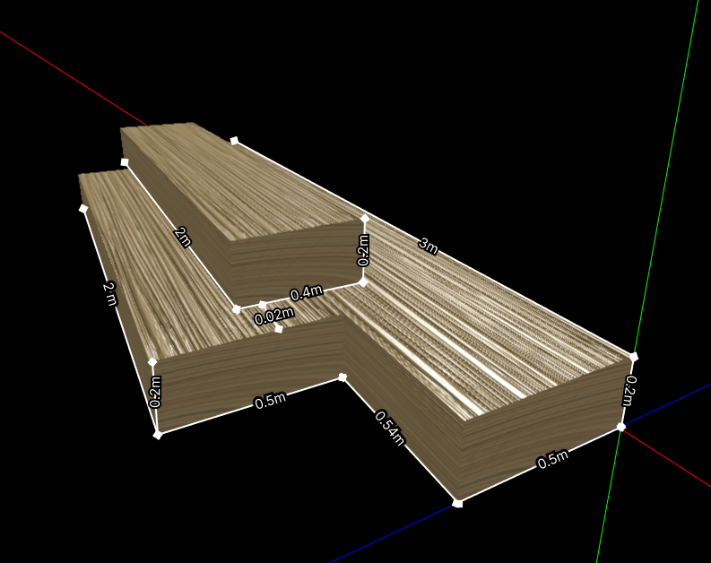

### Instructions

* Clone or fork this repository.
* Create a new branch, `assignment`, for your work.
* Invite @ikhsan017 to be a collaborator.

### Tasks

 * Complete the `Illustration` in the file `js/illustration/illustration-three.js` to render a 3D illustration.
 * Use the `three.js` library to proceed with the rendering.
 * The `wood` model is located in the `model/wood` folder, and the model is in the `FBX` format.
 * Finish the task until the illustration resembles the image shown below.

### Expected Result

